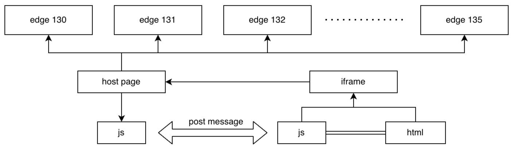

---

# Why this ?
Using postmessage directly to communicate with iframe, the code is very bad
* Lack of type constraints
* Lack of compatible solutions
* Code is scattered and unfocused

So here is an elegant solution:
> Note: The implementation behind this solution still relies on post messages, but it encapsulates those bad codes and only exposes APIs that are highly readable, easy to use, and easy to maintain.


## 1. Provide API to iframe
Suppose we have a mojom handler, it might be used like this
```ts
import { MyMojomHandler } from '/xxxx.mojom-webui.js';

const handler = MyMojomHandler.getRemote();
handler.xxx(1, 2);
handler.yyy('3', '4');
```

only simple codes are needed to expose them to the iframe
```ts
import { initProxy } from 'bridge/host';

const proxy = initProxy();
proxy.registerMethod('xxx', handler.xxx.bind(handler));
proxy.registerMethod('yyy', handler.yyy.bind(handler));
// provide method that is unrelated to mojom handler
proxy.registerMethod('log', (msg: string) => console.log(msg));
```

In the iframe, it can also be associated in a simple way
```ts
import { linkHost } from 'bridge/iframe';

// if a method has return value, it must be a promise, because the response received after post message must be asynchronous
interface Methods {
  xxx: (a: number, b: number) => Promise<number>;
  yyy: (a: string, b: string) => Promise<void>;
  log: (msg: string) => void;
}

const { methods } = linkHost<Methods, any>('edge://underside_chat_v2');
methods.xxx(1, 2).then(console.log);
methods.yyy('3', '4');
methods.log('this is a test message');
```


### Compatibility Management
Assume that there is such a scenario
* In the new version of edge, a new API is added
* The js code of the iframe is placed on the CDN, and it will be loaded and used by any version of edge



new API in the new version of edge
```ts
proxy.registerMethod('zzz', handler.zzz.bind(handler));
```

then if the code in iframe `methods.zzz()` runs on an old version of edge, it may never get the expected results.

Don't worry, the host will automatically send the available API list to the iframe, so when you access `methods.zzz` in the old version of edge, you will get undefined. Then, the code can be:
```ts
interface Methods {
  ······
  // the new api should be undefined in an old version of edge
  zzz?: () => void
}
const { methods } = linkHost<Methods, any>('edge://underside_chat_v2');
methods.zzz?.();
```

### Group APIs
in the host
```ts
const proxy1 = initProxy({ scope: 'Group1' });
proxy1.registerMethod('xxx', handler1.xxx.bind(handler1));

const proxy2 = initProxy({ scope: 'Group2' });
proxy2.registerMethod('yyy', handler2.yyy.bind(handler2));
```

in the iframe
```ts
const { methods1 } = linkHost<Methods1, any>('edge://underside_chat_v2', { scope: 'Group1' });
methods1.xxx(1, 2).then(console.log);

const { methods2 } = linkHost<Methods2, any>('edge://underside_chat_v2', { scope: 'Group2' });
methods2.yyy('3', '4');
```

this may be useful if you have 2 mojom handlers


## 2. Provide Events for iframe
Suppose we have a mojom page callback router, it might be used like this
```ts
import { MyPageCallbackRouter, MyMojomHandler } from '/xxxx.mojom-webui.js';

const handler = MyMojomHandler.getRemote();
const page = new MyPageCallbackRouter();
handler.registerPage(page.$.bindNewPipeAndPassRemote());

page.xxx.addListener((a: number, b: number) => {
  // ·······
});
page.yyy.addListener((a: string, b: string) => {
  // ·······
});
```

only simple codes are needed to expose them to the iframe
```ts
import { initProxy } from 'bridge/host';

const proxy = initProxy();
page.xxx.addListener(proxy.registerEvent('xxx'));
page.yyy.addListener(proxy.registerEvent('yyy'));
// fire any custom event that is not related to mojom page
const fire = proxy.registerEvent('test');
fire('host', 'test message');
```

In the iframe, it can also be associated in a simple way
```ts
import { linkHost } from 'bridge/iframe';

interface Events {
  xxx: (a: number, b: number) => void;
  yyy: (a: string, b: string) => void;
  test: (from: string, msg: string) => void;
}

const { events } = linkHost<any, Events>('edge://underside_chat_v2');
events.xxx.on(console.log);
events.yyy.on(console.log);
events.test.on(console.log);
```

### Group
This part is the same as mentioned above, so, won’t go into details here.

### Remove listener
For example, if it only needs to be executed once:
```ts
const off = events.xxx.on(() => {
  // do something
  off();
});
```

Or, give a duration to indicate how long it lasts.
```ts
// the listener will automatically be removed after 5000ms
events.xxx.on(() => { /* do something */ }, 5000);
```


# Test coverage

File       | % Stmts | % Branch | % Funcs | % Lines
-----------|---------|----------|---------|--------
All files  |     100 |    93.33 |     100 |     100
 common.ts |     100 |      100 |     100 |     100
 host.ts   |     100 |       96 |     100 |     100
 iframe.ts |     100 |    90.32 |     100 |     100
