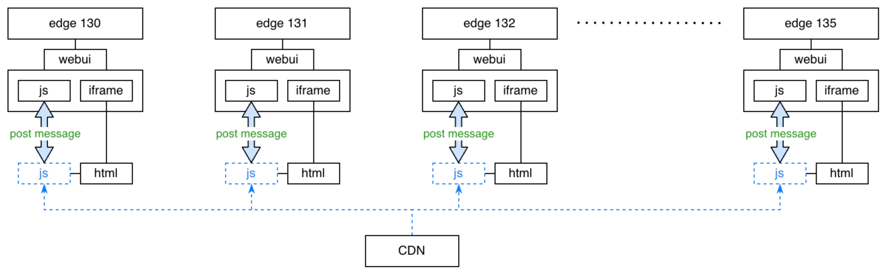

---

# Why this ?
Using postmessage directly to communicate with iframe, the code is very bad
* Lack of type constraints
* Lack of compatible solutions
* Code is scattered and unfocused

```ts
// constant.ts
export const GET_PAGE_CONTENT_REQUEST = 'GET_PAGE_CONTENT_REQUEST';
export const GET_PAGE_CONTENT_RESPONSE = 'GET_PAGE_CONTENT_RESPONSE';
export const GET_XXX_REQEUST = 'GET_XXX_REQEUST';
export const GET_XXX_RESPONSE = 'GET_XXX_RESPONSE';
export const GET_YYY_REQEUST = 'GET_YYY_REQEUST';
export const GET_YYY_RESPONSE = 'GET_YYY_RESPONSE';

// host page
import { GET_PAGE_CONTENT_REQUEST, GET_PAGE_CONTENT_RESPONSE } from './constant';
window.addEventListener('message', (event) => {
  switch (event.data.type) {
    case GET_PAGE_CONTENT_REQUEST: {
      // do something
      const requestId = event.data.requestId;
      const response = { type: GET_PAGE_CONTENT_RESPONSE, data: '...', requestId };
      event.source.postMessage(response, event.origin);
      break;
    }
    case 'xxx_request': {
      // do something
      break;
    }
    case 'yyy_request': {
      // do something
      break;
    }
    default: break;
  }
});

// in iframe
import { GET_PAGE_CONTENT_REQUEST, GET_PAGE_CONTENT_RESPONSE } from './constant';

interface PostMessageListener {
  requestId: string;
  resolve: (data: any) => void;
}
let listeners: Array<PostMessageListener> = [];

window.addEventListener('message', (event) => {
  switch (event.data.type) {
    case GET_PAGE_CONTENT_RESPONSE: {
      const { requestId, data } = event.data;
      listeners = listeners.filter(listener => {
        if (listener.requestId === requestId) {
          listener.resolve(data);
          return false; // remove this listener
        }
        return true; // keep this listener
      });
      break;
    }
    case 'xxx_response': {
      // do something
      break;
    }
    case 'yyy_response': {
      // do something
      break;
    }
    default: break;
  }
});

export function getPageContent() {
  const requestId = 'esdfsrt32231123';
  window.parent.postMessage({ type: GET_PAGE_CONTENT_REQUEST, requestId }, 'edge://underside_chat_v2');
  return new Promise((resolve) => {
    listeners.push({ requestId, resolve });
  });
}
```

For more details, please refer to **[bad postMessage](./docs//bad-post-message.md)**

So here is an elegant solution:
> Note: The implementation behind this solution still relies on post messages, but it encapsulates those bad codes and only exposes APIs that are highly readable, easy to use, and easy to maintain.

For the architecture and principles behind it, please refer to **[architecture](./docs/architecture.md)**

## 1. Provide API to iframe
Suppose we have a mojom handler, it might be used like this
```ts
import { MyMojomHandler } from '/xxxx.mojom-webui.js';

const handler = MyMojomHandler.getRemote();
handler.getPageContent().then((data: string) => {
  // do something with data
});
handler.xxx(1, 2);
handler.yyy('3', '4');
```

only simple codes are needed to expose them to the iframe
```ts
import { initProxy } from 'bridge/host';

const proxy = initProxy();
proxy.registerMethod('getPageContent', handler.getPageContent.bind(handler));
proxy.registerMethod('xxx', handler.xxx.bind(handler));
proxy.registerMethod('yyy', handler.yyy.bind(handler));
// provide method that is unrelated to mojom handler
proxy.registerMethod('log', (msg: string) => console.log(msg));
```

In the iframe, it can also be associated in a simple way
```ts
import { linkHost } from 'bridge/iframe';

// if a method has return value, it must be a promise, because the response received after post message must be asynchronous
interface Methods {
  getPageContent: () => Promise<string>;
  xxx: (a: number, b: number) => Promise<number>;
  yyy: (a: string, b: string) => Promise<void>;
  log: (msg: string) => void;
}

const { methods } = linkHost<Methods, any>('edge://underside_chat_v2');
methods.getPageContent().then((data) => { /* use data */ })
methods.xxx(1, 2).then(console.log);
methods.yyy('3', '4');
methods.log('this is a test message');
```


### Compatibility Management
Assume that there is such a scenario
* all versions of edge client load the the same js file from CDN
* a new js file is deployed to the CDN with a new API (zzz) call to the host



#### ☹️ traditional way
By using post message directly, the code in the iframe will always try to call the new API, which may not be available in the old version of edge client, so it will never get response from the host, and the code may be stuck.
```ts
window.addEventListener('message', (event) => {
  switch (event.data.type) {
    case GET_ZZZ_RESPONSE: {
      // will never get here if the code is running on an old version of edge
    }
  }
});
window.parent.postMessage({ type: GET_ZZZ_REQUEST }, 'edge://underside_chat_v2');
```

#### 😊 new way
just provide new API in the lastest version of edge client
```ts
proxy.registerMethod('zzz', handler.zzz.bind(handler));
```

And then, don't worry, the host will automatically send the available API list to the iframe, so when you access `methods.zzz` in the old version of edge, you will get `undefined`. Then, the code can be written in this way:
```ts
interface Methods {
  ······
  // the new api should be undefined in an old version of edge
  zzz?: () => void
}
const { methods } = linkHost<Methods, any>('edge://underside_chat_v2');
// better to judge whether the method is available before calling it
if (methods.zzz) {
  methods.zzz();
}
```

### Group APIs
in the host
```ts
const proxy1 = initProxy({ scope: 'Group1' });
proxy1.registerMethod('xxx', handler1.xxx.bind(handler1));

const proxy2 = initProxy({ scope: 'Group2' });
proxy2.registerMethod('yyy', handler2.yyy.bind(handler2));
```

in the iframe
```ts
const { methods1 } = linkHost<Methods1, any>('edge://underside_chat_v2', { scope: 'Group1' });
methods1.xxx(1, 2).then(console.log);

const { methods2 } = linkHost<Methods2, any>('edge://underside_chat_v2', { scope: 'Group2' });
methods2.yyy('3', '4');
```

this may be useful if you have 2 mojom handlers


## 2. Provide Events for iframe
Suppose we have a mojom page callback router, it might be used like this
```ts
import { MyPageCallbackRouter, MyMojomHandler } from '/xxxx.mojom-webui.js';

const handler = MyMojomHandler.getRemote();
const page = new MyPageCallbackRouter();
handler.registerPage(page.$.bindNewPipeAndPassRemote());

page.xxx.addListener((a: number, b: number) => {
  // ·······
});
page.yyy.addListener((a: string, b: string) => {
  // ·······
});
```

only simple codes are needed to expose them to the iframe
```ts
import { initProxy } from 'bridge/host';

const proxy = initProxy();
page.xxx.addListener(proxy.registerEvent('xxx'));
page.yyy.addListener(proxy.registerEvent('yyy'));
// fire any custom event that is not related to mojom page
const fire = proxy.registerEvent('test');
fire('host', 'test message');
```

In the iframe, it can also be associated in a simple way
```ts
import { linkHost } from 'bridge/iframe';

interface Events {
  xxx: (a: number, b: number) => void;
  yyy: (a: string, b: string) => void;
  test: (from: string, msg: string) => void;
}

const { events } = linkHost<any, Events>('edge://underside_chat_v2');
events.xxx.on(console.log);
events.yyy.on(console.log);
events.test.on(console.log);
```

### Event Group
This part is the same as what mentioned above, so, won’t go into details here.

### Remove listener
For example, if it only needs to be executed once:
```ts
const off = events.xxx.on(() => {
  // do something
  off();
});
```

Or, give a duration to indicate how long it lasts.
```ts
// the listener will automatically be removed after 5000ms
events.xxx.on(() => { /* do something */ }, 5000);
```


# Test coverage

File       | % Stmts | % Branch | % Funcs | % Lines
-----------|---------|----------|---------|--------
All files  |     100 |    93.33 |     100 |     100
 common.ts |     100 |      100 |     100 |     100
 host.ts   |     100 |       96 |     100 |     100
 iframe.ts |     100 |    90.32 |     100 |     100
