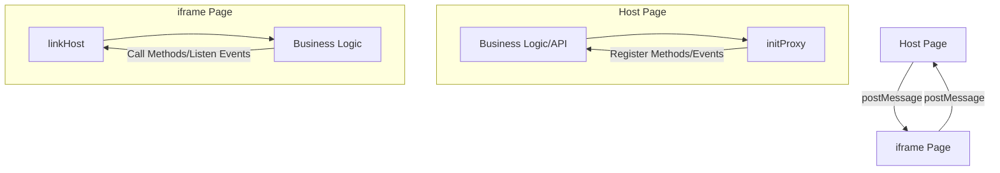
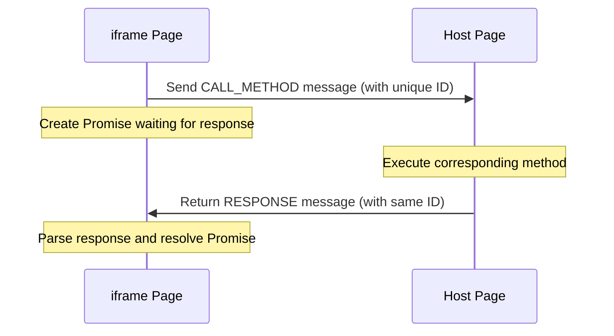
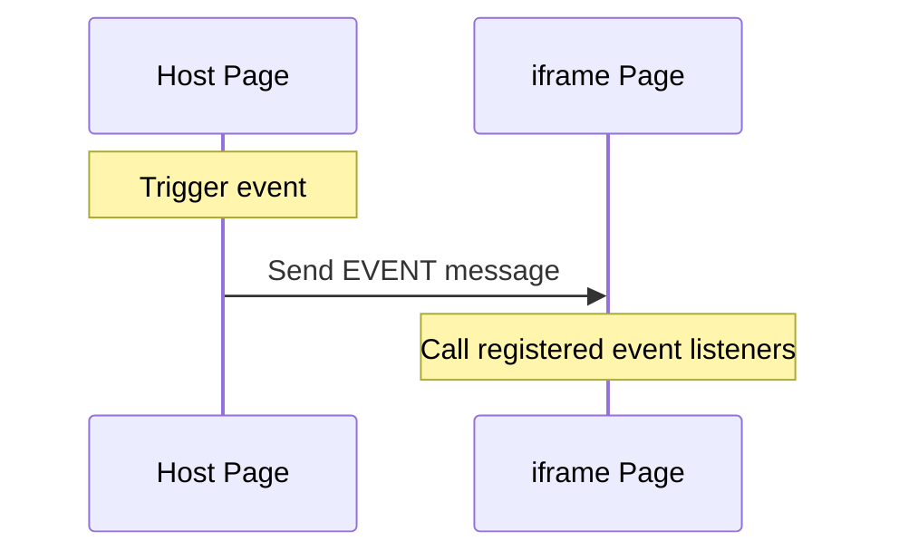

# iframe-bridge Architecture Design Document

## 1. Architecture Overview

iframe-bridge is a library designed to solve communication problems between iframes and host pages. It provides a type-safe, easy-to-use, and reliable communication solution by encapsulating the underlying postMessage API. The library consists of three core modules:

- `common.ts` - Defines common interfaces, types, and utility functions
- `host.ts` - Implements communication on the host page side
- `iframe.ts` - Implements communication on the iframe side



## 2. Core Design Principles

- **Type Safety** - Utilizing TypeScript's generic system to provide compile-time type checking
- **Ease of Use** - Encapsulating complex postMessage communication logic into simple method calls and event subscriptions
- **Reliability** - Built-in error handling, timeout processing, and version compatibility mechanisms
- **Extensibility** - Support for method and event grouping to manage complex scenarios

## 3. Communication Flow Details

### 3.1 Method Call Flow

When an iframe calls a method on the host page, the entire flow is as follows:



Specific code implementation:

1. **iframe Side Initiation**:

```typescript
// Core implementation in iframe.ts
function methodGetter(target: any, method: string | symbol) {
  if (exist_methods && !exist_methods.has(method)) return;
  if (!target[method]) {
    target[method] = (...args: any[]) => {
      const mid = uuid(); // Generate unique message ID
      win.parent.postMessage({ type: Bridge.CALL_METHOD, mid, method, args, scope }, origin);
      return new Promise<any>((resolve, reject) => {
        requests[mid] = { resolve, reject }; // Save callback
        setTimeout(() => done(mid, undefined, Bridge.TIME_OUT), 5000); // Set timeout
      });
    };
  }
  return target[method];
}
```

2. **Host Side Processing**:

```typescript
// Processing logic in host.ts
win.addEventListener('message', (event) => {
  // ...Validate message source
  const { type, mid, method, args } = data;
  if (type === Bridge.CALL_METHOD && mid) {
    onCall(methods[method], args)
      .then(([res, err]) => frame.postMessage({
          type: Bridge.RESPONSE, mid, res, err, scope
        }, origin));
  }
});
```

### 3.2 Event Propagation Flow

The flow of the host page triggering events and the iframe receiving events is as follows:



Specific code implementation:

1. **Host Side Event Triggering**:

```typescript
// Event sending in host.ts
function emit(event: string, args: any[]) {
  frames.forEach((f, origin) => {
    f.postMessage({ type: Bridge.EVENT, event, args, scope }, origin);
  });
}
```

2. **iframe Side Event Listening**:

```typescript
// Event handling in iframe.ts
win.addEventListener('message', ({ source, data = {} }) => {
  // ...Validate message source
  const { type, event = '', args = [] } = data;
  if (type === Bridge.EVENT) {
    return events[event].trigger(args);
  }
});
```

## 4. Key Technical Implementations

### 4.1 Dynamic Method Generation and Proxy

The communication library uses JavaScript's Proxy feature to dynamically generate methods and event handlers, making API usage feel very natural:

```typescript
// In iframe.ts
const methods = new Proxy({}, { get: methodGetter });
const events = new Proxy({}, { get: eventGetter });
```

When accessing `methods.someMethod`, if the method doesn't exist, it will dynamically create a function to handle the communication logic.

### 4.2 Method Availability Detection Mechanism

To solve different version compatibility issues, iframe-bridge implements method availability detection:

1. The host page automatically broadcasts available method lists to all iframes:

```typescript
// host.ts
methods[Bridge.ENUM_METHODS] = () => Object.keys(methods);
const updateMethods = delayExecute(() => emit(Bridge.ENUM_METHODS, [Object.keys(methods)]));
```

2. iframe receives and stores the available method list:

```typescript
// iframe.ts
function setMethods(list: any) {
  if (!Array.isArray(list) || list.length === 0) return;
  exist_methods = new Set(list);
}

// Get method list during initialization
methods[Bridge.ENUM_METHODS]().then(setMethods).catch(() => {});
events[Bridge.ENUM_METHODS].on(setMethods);
```

3. Check if a method is available in the method proxy:

```typescript
function methodGetter(target: any, method: string | symbol) {
  if (exist_methods && !exist_methods.has(method)) return;
  // ...Method creation logic
}
```

This ensures that iframes can only access methods that are actually provided by the host, enhancing cross-version compatibility.

### 4.3 Scope Isolation

Through the `scope` parameter, iframe-bridge supports communication isolation for different scopes, allowing multiple communication groups to coexist:

```typescript
// Use the same scope in host and iframe
const proxy = initProxy({ scope: 'Group1' });
const { methods } = linkHost<Methods, Events>('origin', { scope: 'Group1' });
```

Implementation principle:

```typescript
// Judge if scope matches
const diffScope = scope ? ((s?: string) => (s !== scope)) : Boolean;

// Filter out non-matching scopes in message processing
if (diffScope(data.scope)) return;
```

### 4.4 Event Listener Lifecycle Management

iframe-bridge provides flexible event listener lifecycle management:

```typescript
// Event listener management in iframe.ts
on: (fn: Function, timeout = 0) => {
  list.add(fn);
  const remove = () => list.delete(fn);
  if (timeout > 0) setTimeout(remove, timeout);
  return remove;
}
```

This allows users to:
- Manually remove listeners: `const off = events.xxx.on(handler); off();`
- Set automatic expiration: `events.xxx.on(handler, 5000); // Automatically removed after 5 seconds`

## 5. Type System

iframe-bridge provides excellent type safety through TypeScript generics:

```typescript
// Define interfaces on the iframe side
interface Methods {
  getData: (id: number) => Promise<DataType>;
  saveData: (data: DataType) => Promise<void>;
}

interface Events {
  dataChanged: (id: number, data: DataType) => void;
  connectionStatus: (status: boolean) => void;
}

// Establish a type-safe connection
const { methods, events } = linkHost<Methods, Events>(origin);

// Enjoy complete type checking and auto-completion
methods.getData(123).then(data => console.log(data.property));
events.dataChanged.on((id, data) => console.log(id, data.property));
```

## 6. Error Handling

iframe-bridge has built-in comprehensive error handling mechanisms:

1. **Method Call Errors**:
   - When a host method execution fails, the error is captured and notified to the iframe
   - If a method doesn't exist, a specific error code is returned

2. **Communication Timeout Handling**:
   - A default 5-second timeout is set for each method call
   - After timeout, the Promise is automatically rejected to avoid long-term suspension

3. **Message Source Verification**:
   - Verifies the message source window and domain to enhance security

## 7. Summary

iframe-bridge successfully hides the complexity of the postMessage API through careful design encapsulation, providing developers with a simple, type-safe, and reliable cross-iframe communication solution. It doesn't fundamentally solve the inherent drawbacks of postMessage, but rather through reasonable abstraction, allows developers to avoid facing these issues directly.

Main advantages:
- Converts asynchronous communication model into intuitive method calls and event subscriptions
- Provides complete type safety, reducing runtime errors
- Built-in error handling and timeout processing, improving communication reliability
- Supports method scope isolation and version compatibility detection