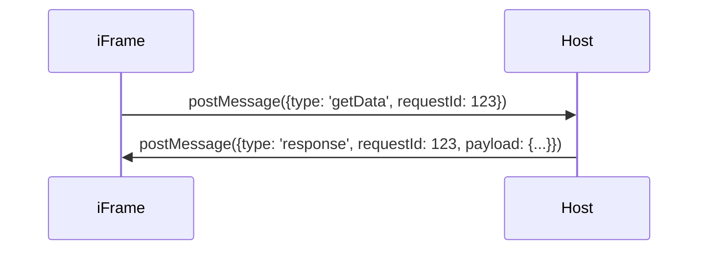
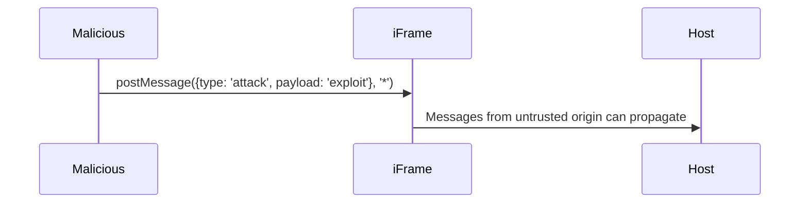

# Analysis of postMessage Drawbacks

## Overview
`postMessage` is a Browser API that facilitates communication between different windows or iframes. It plays a significant role in enabling cross-origin communication and decoupled component interactions. However, `postMessage` suffers from certain design limitations, leading to increased code complexity and reduced readability and maintainability.


## Drawback 1: Messages Are Untyped

### Problem Description
Messages sent via `postMessage` are untyped. On the receiving side, `event.data` is of type `any`, meaning developers cannot perform static type checking. This untyped nature increases the likelihood of bugs related to message structure and adds to debugging difficulty.

### Example Code
```javascript
// Host page
iframe.contentWindow.postMessage({ type: 'greet', message: 'hello' }, '*');

// Inside iframe
window.addEventListener('message', (event) => {
    // event.data is of any type, with no strict constraints
    console.log(event.data.message);
});
```

In the example above, `event.data` is loosely structured, making it prone to misuse by other developers. For instance, if `event.data` does not contain the expected `message` field or the field type is incorrect, it would generate unexpected errors.

With untyped messages, the developer has no compile-time guarantees. Errors like typos in the `type` field or changes in the message structure are caught only at runtime, increasing maintenance effort.


## Drawback 2: Lack of Built-in Callback Support

### Problem Description
`postMessage` is designed as a one-way communication mechanism. When an iframe sends a message to the host (or vice versa) and expects a response, there is no built-in mechanism for handling callbacks. Developers must manually listen to the `message` event, parse the response, and match it with the original request. Additionally, a custom protocol must be implemented to define and handle message types and structure.

### Example Code

#### Sending a Message
The iframe requests data from the host and expects a response:

```javascript
// Inside iframe
const requestId = Math.random();
window.parent.postMessage({ type: 'getData', requestId }, '*');

window.addEventListener('message', (event) => {
    if (event.data.type === 'response' && event.data.requestId === requestId) {
        console.log('Received response:', event.data.payload);
    }
});
```

#### Receiving and Responding to the Message
The host listens for messages and replies accordingly:

```javascript
// Host page
window.addEventListener('message', (event) => {
    if (event.data.type === 'getData') {
        event.source.postMessage({
            type: 'response',
            requestId: event.data.requestId,
            payload: { data: 'Hello from Host' }
        }, event.origin);
    }
});
```

### key Points
1. **Extra Event Listeners**: Developers need to design and maintain additional listeners for one-time request-response interactions.
2. **Request-Response Matching**: Developers must implement mechanisms like `requestId` to correlate requests with their corresponding responses.
3. **Protocol Complexity**: Developers need to establish and document conventions for message types (e.g., `'getData'`, `'response'`) and ensure both sides strictly follow them.




As shown in the diagram, developers must maintain the correlation between request and response using mechanisms like `requestId`. Additionally, they need to write extra handler logic on both ends.

## Drawback 3: Manual Source and Security Validation

### Problem Description
To ensure reliable communication, the receiver of a `postMessage` must include additional logic to validate the source of the message. Developers need to manually check the sender's domain (`event.origin`) and the sender window reference (`event.source`) to ensure that messages are from trusted sources. If these checks are missed or implemented incorrectly, security vulnerabilities such as cross-site scripting (XSS) attacks may occur.

### Example Code
```javascript
// Inside iframe (insecure implementation)
window.addEventListener('message', (event) => {
    // Missing origin validation, may accept malicious messages
    console.log('Received:', event.data);
});

// Host page
iframe.contentWindow.postMessage({ type: 'secureData', message: 'secret' }, '*');
```

#### Proper Validation Example
```javascript
// Inside iframe
window.addEventListener('message', (event) => {
    if (event.origin !== 'https://trustedhost.com') {
        console.log('Untrusted origin, ignoring message.');
        return;
    }
    console.log('Received:', event.data);
});
```

### key Points
1. **Easy to Overlook**: While `origin` and `source` are explicitly provided, developers might ignore validating them, especially during rapid prototyping.
2. **Source Complexity**: In multi-level nested iframes or cross-origin scenarios, correctly identifying the message source may require additional logic.
3. **High Security Risk**: Failing to validate `origin` and `source` can open avenues for malicious pages to spoof messages and execute unauthorized actions.



If the message source (`event.origin` or `event.source`) is not carefully validated, malicious actors can exploit this gap to perform harmful actions.


## Summary
In common `postMessage` scenarios, the above-listed drawbacks introduce significant challenges for developers:

| Drawback                       | Description                                                                         | Impact                                      |
|--------------------------------|-------------------------------------------------------------------------------------|--------------------------------------------|
| Untyped Messages               | Events carry untyped data, making debugging and maintenance harder                  | Low readability, prone to misuse           |
| Lack of Built-in Callback      | No out-of-the-box request-response handling, requiring custom protocols and logic   | Increased code complexity                  |
| Manual Source and Security Check | Developers must implement origin validation, or risk cross-site scripting (XSS)    | security risks in missed validation   |


## Conclusion
While `postMessage` provides a simple and intuitive way to enable cross-window communication, its limitations can significantly reduce the maintainability and security of code in complex business scenarios. Developers should carefully assess their needs and implement additional solutions to enhance the security and usability of `postMessage` where necessary.